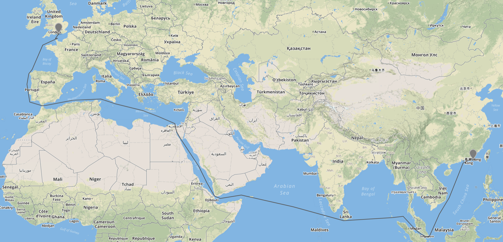

# Searoute.js

An npm package for generating the shortest sea route between two points on Earth. 

If points are on land, the function will attempt to find the nearest point on the sea and calculate the route from there. 

**Not for routing purposes!** This library was developed to generate realistic-looking searoutes for visualizations of maritime routes, not for mariners to route their ships. 

## Installation

~~~bash
npm install searoute-js
~~~

## Usage

~~~javascript
const searoute = require('searoute-js');

// Define origin and destination GeoJSON points:
var origin = {
  "type": "Feature",
  "properties": {},
  "geometry": {
    "type": "Point",
    "coordinates": [
      132.5390625,
      21.616579336740603
    ]
  }
}

var destination = {
    "type": "Feature",
    "properties": {},
    "geometry": {
      "type": "Point",
      "coordinates": [
        -71.3671875,
        75.05035357407698
      ]
    }
  }

var route = searoute(origin, destination);
// > Returns a GeoJSON LineString Feature

// Optionally, define the units for the length calculation included in the properties object.
// Defaults to nautical miles, can be degrees, radians, miles, or kilometers.
var routeMiles = searoute(origin, destination, "miles");

~~~

## Credits

Based on Eurostat's [Searoute Java library](https://github.com/eurostat/searoute) and Dijkstra's algorithm implemented by [perliedman](https://www.liedman.net/geojson-path-finder/).
